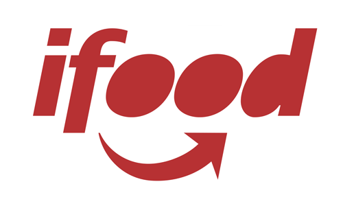
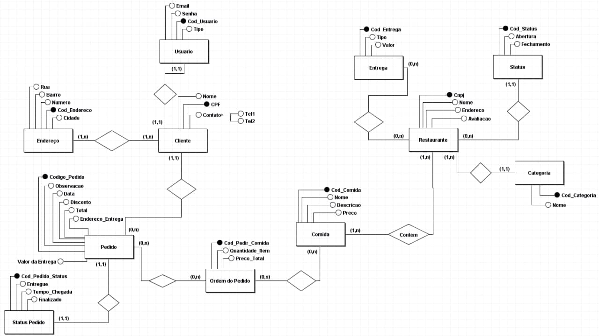

  </img>

# BD-iFood

> Trabalho de banco de dados cujo o objetivo é modelar um sistema que permita que usuários possam perdir comidas pelo celular/website. E o ifood está sendo utilizado como exemplo.

<!-- 

  <a href="#prerequisites">Prerequisites</a>&nbsp;&nbsp;&nbsp;|&nbsp;&nbsp;&nbsp;
  <a href="#objective">Objective</a>&nbsp;&nbsp;&nbsp;|&nbsp;&nbsp;&nbsp;
  <a href="#input-setup">Input Setup</a>&nbsp;&nbsp;&nbsp;|&nbsp;&nbsp;&nbsp;
  <a href="#run">Run</a>&nbsp;&nbsp;&nbsp;|&nbsp;&nbsp;&nbsp;
  <a href="#License">License</a>

-->
## Especificação do trabalho

<!-- 
[Link da especificação](https://docs.google.com/document/d/11Q4mNhD8sqPiyCn2J5m7lRMixcJnaxIFvJiu-09__uk/edit?usp=sharing)
-->
<a href="https://docs.google.com/document/d/11Q4mNhD8sqPiyCn2J5m7lRMixcJnaxIFvJiu-09__uk/edit?usp=sharing" target="_blank">Especificação Detalhada</a>

## Cadastro de usuário

Clientes :

* Nome, email, endereço, telefone e senha;

Restaurantes: 

* Nome, email, endereço, telefone, senha, categoria, status e avaliação

## Funções do Cliente

* Buscar o **nome** do restaurante;
* Buscar uma comida pelo **nome** ou **descrição**;
* Recuperar histórico dos pedidos
	* Pedidos recentes e antigos

## Funções do Restaurante

* Emitir os relatórios de pedidos solicitados e total recebido
	* Preço médio de cada comida num perído de 1 dia, 7 dias ou 30 dias anteriores
	* Comida mais solicitada por mês
* Gerenciar o cardápio
	* Alterando as informações da comida (preço, nome, descrição)
* Optam pelo tipo de entrega
	* Grátis; 
	* Paga.

## Funções do App

O app informará as opções de restaurantes por **categorização** e critérios dinâmicos: 

* Mais pedidos: restaurante com uma das cinco comidas mais pedidas no dia anterior;
* Promoções: preço da comida está por 50% menor em relação aos 7 dias anteriores;
* Entrega grátis;
* Entrega rápida;
* Restaurante popular: s preços do cardápio de um restaurante não ultrapassam R$ 10,00.

## Modelo Relacional

  </img>

